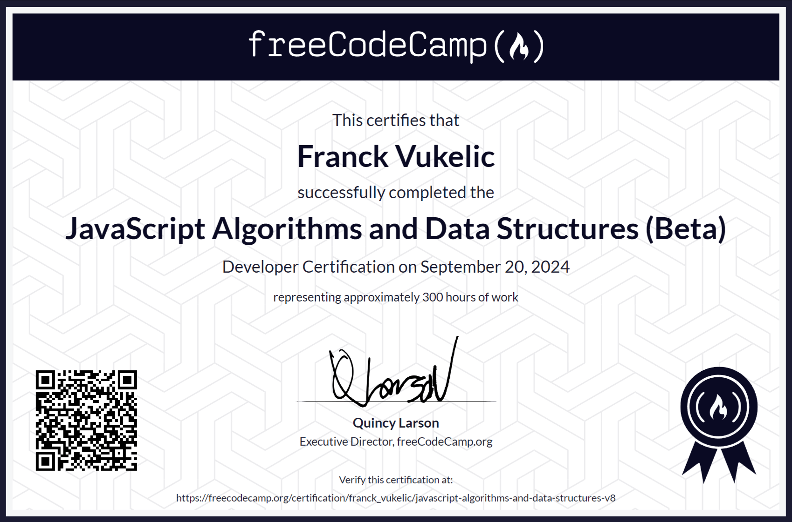

## [JavaScript Algorithms and Data Structures Certification](https://www.freecodecamp.org/learn/javascript-algorithms-and-data-structures-v8)

`[EN]` Developers use HTML and CSS to control the content and styling of a page. And they use JavaScript to make that page interactive.

In this JavaScript Algorithm and Data Structures Certification, you'll learn the JavaScript fundamentals like variables, arrays, objects, loops, functions, the DOM and more.

You'll also learn about Object Oriented Programming (OOP), Functional Programming, algorithmic thinking, how to work with local storage, and how to fetch data using an API.

---

`[FR]` Les développeurs utilisent HTML et CSS pour contrôler le contenu et le style d'une page. Et ils utilisent JavaScript pour rendre cette page interactive.

Dans cette certification en algorithmes et structures de données JavaScript, vous apprendrez les fondamentaux de JavaScript tels que les variables, les tableaux, les objets, les boucles, les fonctions, le DOM, et bien plus encore.

Vous apprendrez également la Programmation Orientée Objet (OOP), la Programmation Fonctionnelle, la pensée algorithmique, comment travailler avec le stockage local, et comment récupérer des données à l'aide d'une API.

---

### Module 1

```
1. Learn Introductory JavaScript by Building a Pyramid Generator
2. Review JavaScript Fundamentals by Building a Gradebook App
3. Learn Basic JavaScript by Building a Role Playing Game
4. Learn Basic Debugging by Building a Random Background Color Changer
5. Learn Form Validation by Building a Calorie Counter
6. Review DOM Manipulation by Building a Rock, Paper, Scissors Game
7. Learn Basic String and Array Methods by Building a Music Player
8. 🎓 Build a Palindrome Checker
```

### Module 2

```
1. Learn the Date Object by Building a Date Formatter
2. Learn Modern JavaScript Methods By Building Football Team Cards
3. Learn localStorage by Building a Todo App
4. Learn Recursion by Building a Decimal to Binary Converter
5. 🎓 Build a Roman Numeral Converter
```

### Module 3

```
1. Learn Regular Expressions by Building a Spam Filter
2. Learn Basic Algorithmic Thinking by Building a Number Sorter
3. Learn Advanced Array Methods by Building a Statistics Calculator
4. Learn Functional Programming by Building a Spreadsheet
4. 🎓 Build a Telephone Number Validator
```

### Module 4

```
1. Learn Basic OOP by Building a Shopping Cart
2. Learn Intermediate OOP by Building a Platformer Game
3. Review Algorithmic Thinking by Building a Dice Game
4. 🎓 Build a Cash Register
```

### Module 5

```
1. Learn Fetch and Promises By Building an fCC Authors Page
2. Learn Asynchronous Programming by Building an fCC Forum Leaderboard
3. 🎓 Build a Pokémon Search App
```
